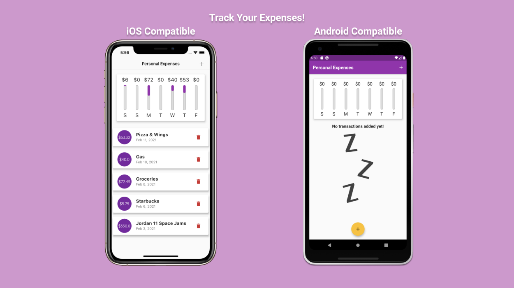

# Personal Expense Manager
Project Name: Personal Expense Manager  
Project Date: October 2020  
Technologies Used: Flutter, Dart  
Project Description: Simple mobile expense tracking application. Enter and view expenses. Cross Platform Compatibility.

## Features

* Open Source
* Cross Platform Compatibility
* iOS Compatible
* Android Compatible
* Add and Track Expenses
* Beautiful Graph Charts For Tracking
* Efficiently Optimized For Small App Size

## Table of Contents
1. [ScreenShots](#screenshots)
2. [Installation](#installation)

## Screenshots

## Installation

## Suggestions
Open to any suggestions and help provided.
